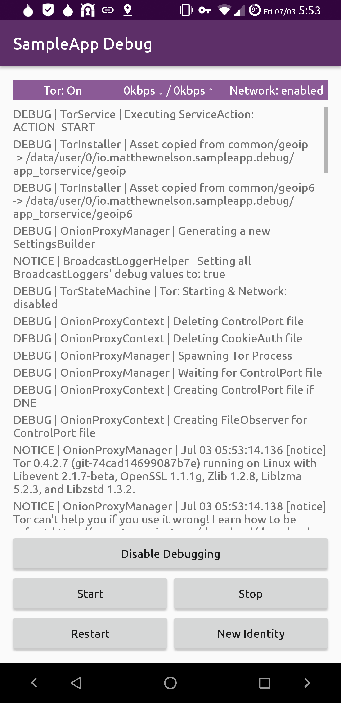

# TorOnionProxyLibrary-Android
An Android Library for embedding Tor as a service into your Application  

**NOTE: This project exists independently of the Tor Project, & Guardian Project.**  

This is a Fork of the 
<a href="https://github.com/thaliproject/Tor_Onion_Proxy_Library" target="_blank">Tor_Onion_Proxy_Library</a> 
project. 

    
    
    

It's been re-built from the ground up and engineered specifically for :material-heart-multiple: 
Android :material-heart-multiple:, where it was once multi-platform. It's been re-written in 
Kotlin, heavily refactored to improve reliability/ease of use, and an `android.app.Service` 
built on top as an additional module/Library for abstracting away complexities.  

The `topl-service` module/Library has simple to use APIs for integrating Tor into your 
application, and customizing the notification to meet your liking.  

## [Project Roadmap](roadmap.md)

## [Get started!](get_started.md)

## Other Projects Using It
<!-- Example (copy between the brackets [] below): -->
<!-- [- <a href="https://your.project.website.com" target="_blank">Your Project's Name</a>] -->

!!! Info
    Add your project to the list by submitting a PR!  
    Edit <a href="https://github.com/05nelsonm/TorOnionProxyLibrary-Android/blob/master/docs/index.md" target="_blank">This Document</a>

## License <a href="https://github.com/05nelsonm/TorOnionProxyLibrary-Android/blob/master/LICENSE" target="_blank">:material-link-box-variant-outline:</a>

TorOnionProxyLibrary-Android (a.k.a. topl-android) is a derivation of  
work from the Tor_Onion_Proxy_Library project that started at commit  
hash 74407114cbfa8ea6f2ac51417dda8be98d8aba86. Contributions made after  
said commit hash are:  

Copyright (C) 2020 Matthew Nelson  

This program is free software: you can redistribute it and/or modify  
it under the terms of the GNU General Public License as published by  
the Free Software Foundation, either version 3 of the License, or  
(at your option) any later version.  

This program is distributed in the hope that it will be useful,  
but WITHOUT ANY WARRANTY; without even the implied warranty of  
MERCHANTABILITY or FITNESS FOR A PARTICULAR PURPOSE.  See the  
GNU General Public License for more details.  

You should have received a copy of the GNU General Public License  
along with this program.  If not, see <a href="https://www.gnu.org/licenses/gpl-3.0.html" target="_blank">here</a>.  

`===========================================================================`  
`+++++++++++++++++++++++++++++++++++++++++++++++++++++++++++++++++++++++++++`  
`===========================================================================`  

The original code, prior to commit hash 74407114cbfa8ea6f2ac51417dda8be98d8aba86,  
was:  

Copyright (c) Microsoft Open Technologies, Inc.  
All Rights Reserved  

Licensed under the Apache License, Version 2.0 (the "License");  
you may not use this file except in compliance with the License.  
You may obtain a copy of the License at http://www.apache.org/licenses/LICENSE-2.0  

THIS CODE IS PROVIDED ON AN *AS IS* BASIS, WITHOUT WARRANTIES OR  
CONDITIONS OF ANY KIND, EITHER EXPRESS OR IMPLIED, INCLUDING  
WITHOUT LIMITATION ANY IMPLIED WARRANTIES OR CONDITIONS OF TITLE,  
FITNESS FOR A PARTICULAR PURPOSE, MERCHANTABLITY OR NON-INFRINGEMENT.  

See the Apache 2 License for the specific language governing permissions and  
limitations under the License.  
